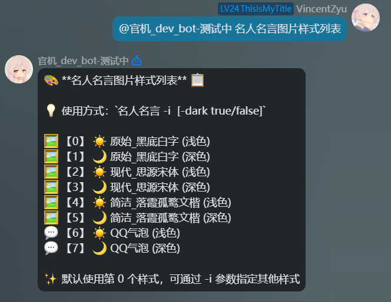
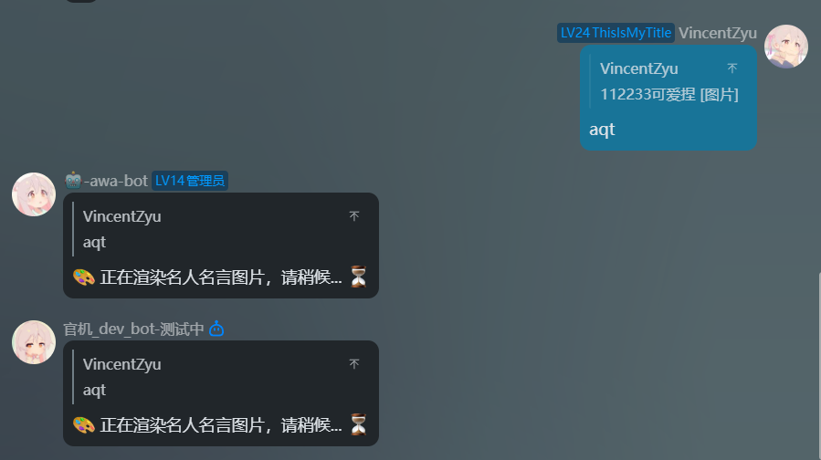
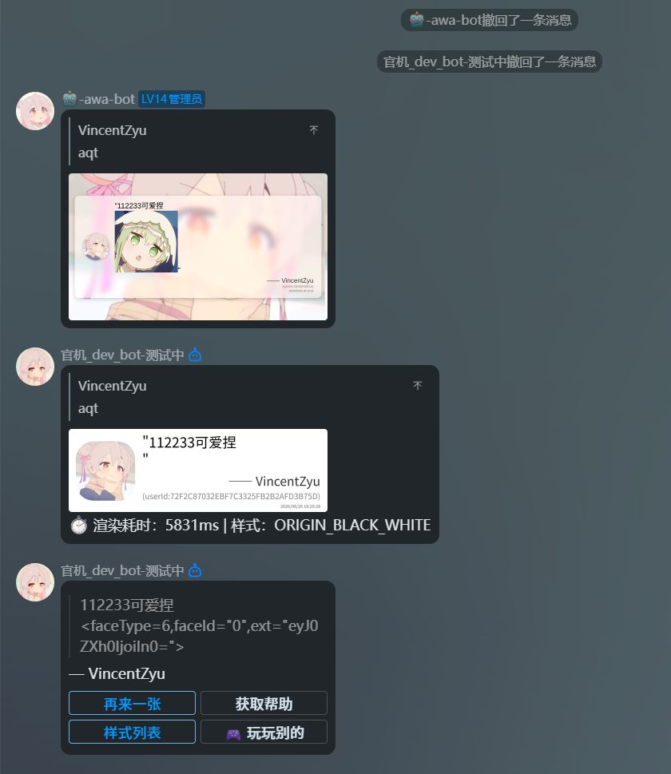

> **[📖 查看完整更新日志（含 fork 版本与上游版本历史）→](./CHANGELOG.md)**


# 🎭 koishi-plugin-awa-quote-image

[](https://www.npmjs.com/package/koishi-plugin-awa-quote-image)
[](https://www.npmjs.com/package/koishi-plugin-awa-quote-image)

[](https://github.com/VincentZyuApps/koishi-plugin-awa-quote-image)
[](https://gitee.com/vincent-zyu/koishi-plugin-awa-quote-image)

[](https://forum.koishi.xyz/t/topic/12566)
[](https://qm.qq.com/q/ZN7fxZ3qCq)

<h2>💬 交流反馈</h2>
<p>🐛 Bug 反馈 / 💡 建议 / 👨‍💻 插件开发交流，欢迎加群：</p>
<p><del>💬 插件使用问题 / 🐛 Bug反馈 / 👨‍💻 插件开发交流，欢迎加入QQ群：<b>259248174</b>   🎉（这个群G了）</del></p> 
<p>💬 插件使用问题 / 🐛 Bug反馈 / 👨‍💻 插件开发交流，欢迎加入QQ群：<b>1085190201</b> 🎉</p>
<p>💡 在群里直接艾特我，回复的更快哦~ ✨</p>


# 🎨 把群u的名人名言发言渲染成图片！✨

## ⚠️ 重要提示

**🔴 本插件需要启用 `puppeteer` 和 `http` 服务才能正常使用！**

请确保在 Koishi 控制台中已经安装并启用了以下插件：
- 📦 `puppeteer` - 用于渲染图片
- 🌐 `http` - 用于网络请求
- 💾 `database` - 可选，用于 QQ 官方 Bot 引用消息的磁盘缓存

如果没有安装 `puppeteer` 和 `http`，本插件将无法工作。`database` 是可选服务；QQ 引用缓存默认使用 database 模式，未启用 database 时会自动退回内存缓存。

### 字体下载说明
插件会自动下载并校验字体，优先使用 Gitee release，失败后 fallback 到 GitHub release。手动下载直链见下方「📥 字体文件获取说明」。

---

## 🚀 功能介绍

Koishi 插件，回复一条消息，渲染"名人名言"图片。支持多种图片样式，让你的群聊更加有趣！🎉

> **[📖 查看完整更新日志（含 fork 版本与上游版本历史）→](./CHANGELOG.md)**

## 📖 使用方法

### 1. 📋 查看图片样式列表

```
名人名言图片样式列表
```

这个指令可以显示所有可用的图片样式：



### 2. 🖼️ 制作名人名言图片

```
aqt
```

**使用步骤：**
1. 💬 回复/引用某个群友的消息
2. 📝 发送 `aqt` 指令
3. ⏳ 等待渲染完成，获得精美的名人名言图片

**可选参数：**
- `-i <数字>` 或 `--index <数字>`: 指定图片样式索引 🎯
- `-v` 或 `--verbose`: 显示详细参数信息 📊
- `--no-newlines`: 折叠原始消息换行 📝

**示例：**
```
aqt -i 1    # 使用现代思源宋体样式 ✨
aqt -i 2    # 使用简洁文楷样式 🎨
aqt -v      # 显示详细信息 📊
```




**所有可用的图片样式：**

- 【0】: 原始_黑底白字 (白天模式) ⚫☀️

- 【1】: 原始_黑底白字 (黑夜模式) ⚫🌙

- 【2】: 现代_思源宋体 (白天模式) ✨☀️

- 【3】: 现代_思源宋体 (黑夜模式) ✨🌙

- 【4】: 简洁_落霞孤鹜文楷 (白天模式) 🎨☀️

- 【5】: 简洁_落霞孤鹜文楷 (黑夜模式) 🎨🌙

- 【6】: QQ消息气泡 (白天模式) 💬☀️

- 【7】: QQ消息气泡 (黑夜模式) 💬🌙


## 🎨 图片样式预览

- **原始黑底白字** ⚫: 经典黑白配色，简洁大方
- **现代思源宋体** ✨: 磨砂玻璃效果，渐变背景，现代高级感
- **简洁文楷** 🎨: 扁平化设计，清爽简约，适合日常使用
- **QQ 消息气泡** 💬: 模仿 QQ 原生气泡卡片，可显示群头衔/等级

## 🤖 QQ 官方 Bot 适配说明

本插件对 QQ官方Bot平台 做了专门适配：

- 严格使用被引用消息作者的头像和用户名。
- 如果无法获取被引用消息作者完整的 `content / userId / username / avatar`，会直接在控制台和会话内报错并停止渲染。
- 不会 fallback 到触发 `aqt` 指令的用户，避免引用 A 的消息却渲染成 B 的头像和昵称。
- QQ 引用解析失败时会优先使用 QQ Markdown 发送错误提示。

相关配置：

- `qqBotAppId`: QQ 官方 Bot AppId，用于拼接 `https://q.qlogo.cn/qqapp/{appId}/{openid}/640` 头像地址；留空则读取适配器的 `bot.config.id`。
- `qqQuoteCacheMode`: QQ 引用缓存模式，支持 `database` / `memory`，默认 `database`。
- `qqQuoteCacheLimitPerChannelid`: 每个 `channel_id` 的 QQ 引用缓存条数上限，默认 `500`。
- `enableQQMarkdown`: QQ 平台发送图片后是否附带 Markdown + 按钮消息。
- `qqMarkdownKeyboardJson`: 自定义 QQ Markdown 按钮 JSON。

缓存模式说明：

- `database`: 磁盘缓存，使用 Koishi database 服务保存 REFIDX 映射，重启后仍可命中。
- `memory`: 内存缓存，重启后清空。

## 🔧 配置项

### 📌 基础配置

| 配置项 | 类型 | 默认值 | 说明 |
|---|---|---|---|
| `acsCommandName` | `string` | `"名人名言图片样式列表"` | 查看图片样式列表的指令名称 |
| `aqtCommandName` | `string` | `"名人名言"` | 制作名人名言图片的指令名称，别名为 `aqt` |

### 💬 会话设置

| 配置项 | 类型 | 默认值 | 说明 |
|---|---|---|---|
| `enableQuote` | `boolean` | `true` | bot 发送消息时是否引用触发指令的消息 |
| `enableWaitingHint` | `boolean` | `true` | 是否显示“正在渲染，请稍候”的等待提示 |
| `inlineMediaAlign` | `"top" \| "middle" \| "bottom"` | `"bottom"` | 引用消息中图片 / 表情与文字的垂直对齐方式 |
| `atRenderMode` | `"none" \| "nick" \| "username"` | `"nick"` | 引用消息中 @ 消息段的渲染方式 |
| `nameStyle` | `"name-only" \| "card-only" \| "name-card" \| "card-name"` | `"name-card"` | 用户名显示样式；群名片需要平台支持群成员资料查询，不支持时显示用户名 |
| `showUserId` | `boolean` | `true` | 是否在图片中显示用户 ID，建议保持开启，降低伪造聊天记录风险 |
| `showTimestamp` | `boolean` | `true` | 是否在图片中显示时间戳，建议保持开启 |
| `showGroupTitleInQqBubble` | `boolean` | `true` | QQ 气泡样式中是否显示群头衔和群等级，仅 OneBot 平台生效 |

### 🖼️ 图片渲染配置

| 配置项 | 类型 | 默认值 | 说明 |
|---|---|---|---|
| `imageStyleDetails` | `ImageStyleDetail[]` | 8 组内置样式 | 图片样式列表，第一行为默认样式，其余可用 `aqt -i <索引>` 指定 |
| `imageStyleDetails[].styleKey` | 样式枚举 | 见默认配置 | 图片模板样式，如原始黑底白字、现代思源宋体、简洁文楷、QQ 消息气泡 |
| `imageStyleDetails[].fontPath` | `string` | 默认字体路径 | 当前样式使用的字体文件路径 |
| `imageStyleDetails[].darkMode` | `boolean` | 见默认配置 | 当前样式是否启用深色模式 |
| `imageWidth` | `number` | `1920` | 渲染图片宽度，单位 px |
| `imageMinHeight` | `number` | `1080` | 渲染图片最小高度，单位 px |
| `imageType` | `"png" \| "jpeg" \| "webp"` | `"png"` | 输出图片格式；PNG 不支持调整 quality |
| `pageScreenshotQuality` | `number` | `60` | Puppeteer 截图质量，范围 0-100，对 PNG 无效 |
| `showRenderInfo` | `boolean` | `false` | 发送图片时是否在消息末尾追加渲染耗时和样式信息 |
| `enableReleaseEmojiFont` | `boolean` | `false` | 是否使用插件从 Gitee/GitHub release 下载的 Twemoji 彩色 emoji 字体；关闭时使用系统 emoji 字体 fallback |
| `emojiFontPath` | `string` | `process.cwd()/data/fonts/TwemojiCOLRv0.ttf` | TwemojiCOLRv0.ttf 字体路径；默认展示 cwd 路径，运行时自动映射到 `ctx.baseDir/data/fonts/TwemojiCOLRv0.ttf` |

### 🤖 QQ 官方 Bot 平台设置

| 配置项 | 类型 | 默认值 | 说明 |
|---|---|---|---|
| `enableQQMarkdown` | `boolean` | `true` | QQ 平台发送图片后是否附带 Markdown + 按钮消息 |
| `qqMarkdownKeyboardJson` | `string` | 默认键盘 JSON | QQ Markdown 按钮 JSON 配置，支持变量 `${aqtCommandName}` `${acsCommandName}` `${userId}` |
| `qqQuoteCacheMode` | `"database" \| "memory"` | `"database"` | QQ 引用消息缓存模式；`database` 使用 Koishi database 服务，`memory` 重启后清空 |
| `qqQuoteCacheLimitPerChannelid` | `number` | `500` | 每个 `channel_id` 的 QQ 引用缓存条数上限，范围 10-1000000 |
| `qqBotAppId` | `string` | `""` | QQ 官方 Bot AppId，用于拼接 `q.qlogo.cn/qqapp/{appId}/{openid}/640` 头像地址；留空则读取 `bot.config.id` |

### 🐛 调试设置

| 配置项 | 类型 | 默认值 | 说明 |
|---|---|---|---|
| `verboseSessionLog` | `boolean` | `false` | 是否在会话中输出详细参数和调试信息；生产环境不建议开启 |
| `verboseConsoleLog` | `boolean` | `false` | 是否在控制台输出详细参数和 QQ 原始事件解析信息 |

## 📥 字体文件获取说明

### 🤖 自动下载
插件会在 apply 阶段和执行 `aqt` 前检查字体文件，自动下载到 Koishi 运行目录的 `data/fonts` 文件夹中。

下载顺序为 **Gitee release 优先**，失败后自动 fallback 到 **GitHub release**。下载完成后会校验 `size + md5 + sha1 + sha256 + sha512`，全部通过才会继续渲染；如果字体不可用，会直接报错并停止渲染。

### 📁 手动下载（如果自动下载失败）
如果自动下载失败，请按以下步骤手动下载字体文件：

1. 🔗 **Gitee 下载地址（优先）**
   - [SourceHanSerifSC-SemiBold.otf](https://gitee.com/vincent-zyu/koishi-plugin-awa-quote-image/releases/download/fonts/SourceHanSerifSC-SemiBold.otf)
   - [LXGWWenKaiMono-Regular.ttf](https://gitee.com/vincent-zyu/koishi-plugin-awa-quote-image/releases/download/fonts/LXGWWenKaiMono-Regular.ttf)
   - [TwemojiCOLRv0.ttf](https://gitee.com/vincent-zyu/koishi-plugin-awa-quote-image/releases/download/fonts/TwemojiCOLRv0.ttf)

2. 🔗 **GitHub 下载地址（fallback）**
   - [SourceHanSerifSC-SemiBold.otf](https://github.com/VincentZyuApps/koishi-plugin-awa-quote-image/releases/download/fonts/SourceHanSerifSC-SemiBold.otf)
   - [LXGWWenKaiMono-Regular.ttf](https://github.com/VincentZyuApps/koishi-plugin-awa-quote-image/releases/download/fonts/LXGWWenKaiMono-Regular.ttf)
   - [TwemojiCOLRv0.ttf](https://github.com/VincentZyuApps/koishi-plugin-awa-quote-image/releases/download/fonts/TwemojiCOLRv0.ttf)

3. 📂 **存放位置**：下载后请将字体文件放入 Koishi 运行目录的 `data/fonts` 文件夹中

4. 📋 **需要的字体文件**：
   - `SourceHanSerifSC-SemiBold.otf` （思源宋体）📝
   - `LXGWWenKaiMono-Regular.ttf` （霞鹜文楷）✍️
   - `TwemojiCOLRv0.ttf` （彩色 emoji，可选；仅开启 `enableReleaseEmojiFont` 时需要）😀

### 🖥️ 使用系统 emoji 字体（Debian / Ubuntu 示例）
`enableReleaseEmojiFont` 默认关闭；关闭时插件不会下载和注入 Twemoji 字体，会使用系统 emoji 字体 fallback。Debian / Ubuntu 可以这样安装：

```bash
apt update
apt install -y fonts-noto-color-emoji fonts-noto-cjk fontconfig
fc-cache -fv
fc-match emoji
fc-match "Noto Color Emoji"
```

然后重启 Koishi。

### 🎨 字体许可说明
本插件使用的字体均为开源免费字体：
- **思源宋体（Source Han Serif SC）** - 由 Adobe 与 Google 联合开发，遵循 SIL Open Font License 1.1 协议 📝
- **霞鹜文楷（LXGW WenKai）** - 由 LXGW 开发并维护，遵循 SIL Open Font License 1.1 协议 ✍️

## ⚠️ 注意事项

- 💬 使用前需要先回复或引用一条消息
- ⏳ 渲染过程需要几秒钟，请耐心等待
- 🖼️ 支持 PNG、JPEG、WEBP 多种输出格式
- 🔤 首次使用时会自动下载并校验字体文件，可能需要稍等片刻；字体不可用时会停止渲染并提示错误
