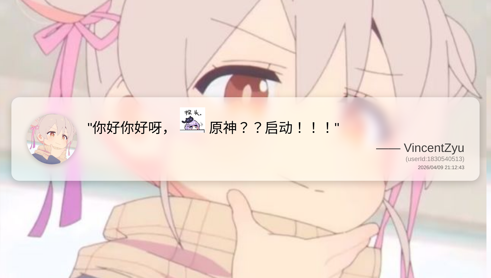
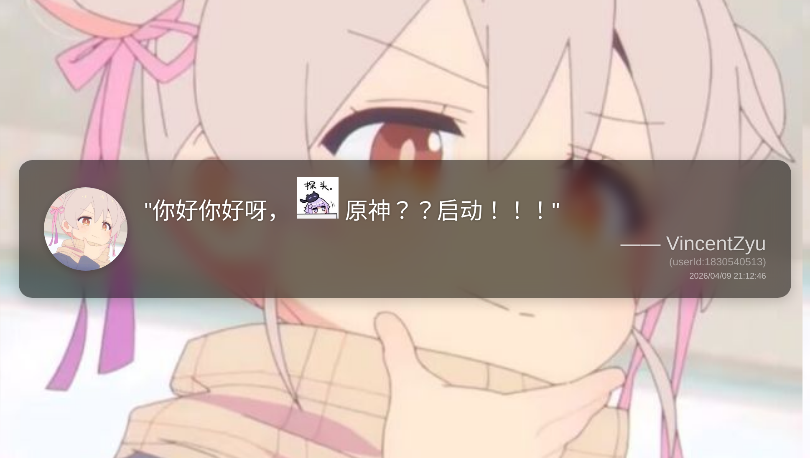
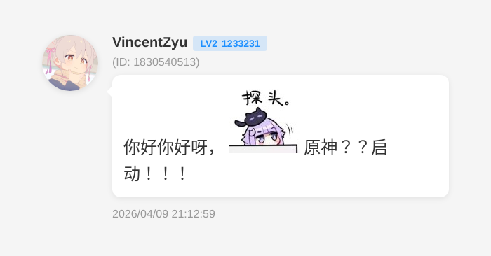
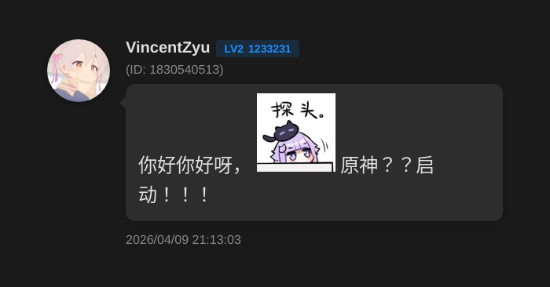

# 🎭 koishi-plugin-awa-quote-image

[](https://www.npmjs.com/package/koishi-plugin-awa-quote-image)
[](https://www.npmjs.com/package/koishi-plugin-awa-quote-image)
[](https://github.com/VincentZyuApps/koishi-plugin-awa-quote-image)
[](https://gitee.com/vincent-zyu/koishi-plugin-awa-quote-image)
[](https://forum.koishi.xyz/t/topic/11986)


<p><del>💬 插件使用问题 / 🐛 Bug反馈 / 👨‍💻 插件开发交流，欢迎加入QQ群：<b>259248174</b>   🎉（这个群G了</del> </p> 
<p>💬 插件使用问题 / 🐛 Bug反馈 / 👨‍💻 插件开发交流，欢迎加入QQ群：<b>1085190201</b> 🎉</p>
<p>💡 在群里直接艾特我，回复的更快哦~ ✨</p>

# 🎨 把群u的名人名言发言渲染成图片！✨

## ⚠️ 重要提示

**🔴 本插件需要启用 `puppeteer` 和 `http` 服务才能正常使用！**

请确保在 Koishi 控制台中已经安装并启用了以下插件：
- 📦 `puppeteer` - 用于渲染图片
- 🌐 `http` - 用于网络请求

如果没有安装这两个插件，本插件将无法工作！

### 字体手动下载链接：
[https://gitee.com/vincent-zyu/koishi-plugin-awa-quote-image/releases/tag/fonts](https://gitee.com/vincent-zyu/koishi-plugin-awa-quote-image/releases/tag/fonts)

---

## 🚀 功能介绍

Koishi 插件，回复一条消息，渲染"名人名言"图片。支持多种图片样式，让你的群聊更加有趣！🎉

## 更新日志
> 0.1.2: 新增 图片中强制展示userId，防止有人伪造聊天记录造成不良后果
> 前面的: 忘了awa，反正你看到的features都是前面更新的

## 📖 使用方法

### 1. 📋 查看图片样式列表

```
名人名言图片样式列表
```

显示所有可用的图片样式：
- 【0】: 原始_黑底白字 (白天模式) ⚫☀️

- 【1】: 原始_黑底白字 (黑夜模式) ⚫🌙

- 【2】: 现代_思源宋体 (白天模式) ✨☀️

- 【3】: 现代_思源宋体 (黑夜模式) ✨🌙

- 【4】: 简洁_落霞孤鹜文楷 (白天模式) 🎨☀️

- 【5】: 简洁_落霞孤鹜文楷 (黑夜模式) 🎨🌙

- 【6】: QQ消息气泡 (白天模式) 💬☀️

- 【7】: QQ消息气泡 (黑夜模式) 💬🌙


### 2. 🖼️ 制作名人名言图片

```
aqt
```

**使用步骤：**
1. 💬 回复/引用某个群友的消息
2. 📝 发送 `aqt` 指令
3. ⏳ 等待渲染完成，获得精美的名人名言图片

**可选参数：**
- `-i <数字>` 或 `--index <数字>`: 指定图片样式索引 🎯
- `-v` 或 `--verbose`: 显示详细参数信息 📊

**示例：**
```
aqt -i 1    # 使用现代思源宋体样式 ✨
aqt -i 2    # 使用简洁文楷样式 🎨
aqt -v      # 显示详细信息 📊
```

## 🎨 图片样式预览

- **原始黑底白字** ⚫: 经典黑白配色，简洁大方
- **现代思源宋体** ✨: 磨砂玻璃效果，渐变背景，现代高级感
- **简洁文楷** 🎨: 扁平化设计，清爽简约，适合日常使用

## 📥 字体文件获取说明

### 🤖 自动下载
插件会在首次使用时自动下载所需字体文件，无需手动操作！

### 📁 手动下载（如果自动下载失败）
如果自动下载失败，请按以下步骤手动下载字体文件：

1. 🔗 **下载地址**：[https://gitee.com/vincent-zyu/koishi-plugin-awa-quote-image/releases/tag/fonts](https://gitee.com/vincent-zyu/koishi-plugin-awa-quote-image/releases/tag/fonts)

2. 📂 **存放位置**：下载后请将字体文件放入插件的 `assets` 文件夹中

3. 📋 **需要的字体文件**：
   - `SourceHanSerifSC-SemiBold.otf` （思源宋体）📝
   - `LXGWWenKaiMono-Regular.ttf` （霞鹜文楷）✍️

### 🎨 字体许可说明
本插件使用的字体均为开源免费字体：
- **思源宋体（Source Han Serif SC）** - 由 Adobe 与 Google 联合开发，遵循 SIL Open Font License 1.1 协议 📝
- **霞鹜文楷（LXGW WenKai）** - 由 LXGW 开发并维护，遵循 SIL Open Font License 1.1 协议 ✍️

## ⚠️ 注意事项

- 💬 使用前需要先回复或引用一条消息
- ⏳ 渲染过程需要几秒钟，请耐心等待
- 🖼️ 支持 PNG、JPEG、WEBP 多种输出格式
- 🔤 首次使用时会自动下载字体文件，可能需要稍等片刻
